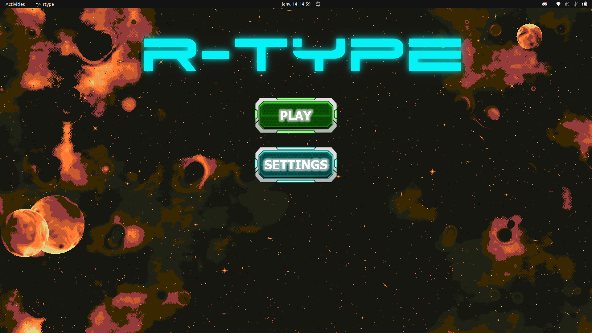
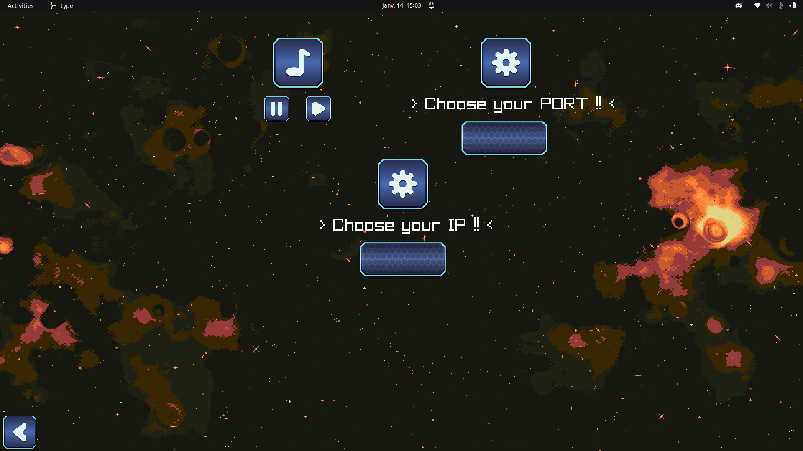
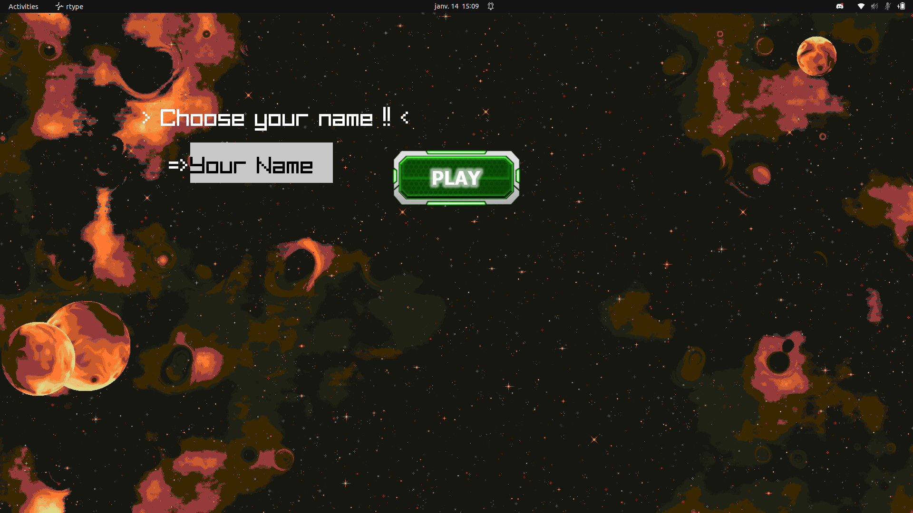

# RType
> *This is an Epitech 3rd-year project.*

<h1 align="center">
  
  <br>
</h1>


## Table of contents
- [Description](#description)
  - [History of the game](#history-of-the-game)
  - [Goal of the project](#goal-of-the-project)
  - [Librairies](#librairies)
  - [Supported Platforms](#Supported-platforms)
- [Installation](#installation)
  - [Clone the project](#clone-the-project)
  - [Launch the script](#launch-the-scipt)
    - [Linux](#linux)
    - [Windows](#windows)
- [Usage](#usage)
  - [Server](#server)
  - [Client](#client)
- [How to play](#how-to-play)
  - [Settings](#settings)
  - [Lobby](#lobby)
  - [Move the player](#move-the-player)
    - [Keyboard](#keyboard)
    - [Controller](#controller)
  - [Kill enemies](#kill-enemies)
  - [Pause Game](#pause-game)
  - [Lose condition](#lose-condition)
- [About all the project](#about-all-the-project)
  - [Protocol documentation](#protocol-documentation)
  - [GameEngine documentation](#gameengine-documentation)
  - [Server documentation](#server-documentation)
  - [Client documentation](#client-documentation)
- [Contributors](#contributors)


## 🚀 Description 🚀

### History of the game

R-Type is an emblematic series of video games of the shoot them up with horizontal scrolling, developed by Irem and begun in 1987 on terminal of arcade. It is probably inspired by the Konami Gradius series, whose first episode was released two years earlier.

### Goal of the project

This project aims to recreate the R-Type game with a multi-threaded server using Boost::asio for the network, udp protocol and graphical client. We using an engine of unity.
R-tpye is composed of two parts: the server and the client, both in C++.

### Librairies
- Graphical : Raylib.
- Network : asio


## 🔮 Installation 🔮

### Clone the project
    git clone --recursive git@github.com:EpitechPromo2026/B-CPP-500-PAR-5-2-rtype-ethan.saux.git

### Launch the script

  #### Linux

  To get started, issue this command to root :
  ```bash
  git submodule update --init --recursive
  ```

  Go to vcpkg directory and run this command :
  ```bash
./bootstrap-vcpkg.sh
  ```

  Go to the root of the project and run this command :
  ```bash
  ./scripts/build_project.sh
  ```

  #### Windows

  To get started, issue this command to root :
  ```powershell
  git submodule update --init --recursive
  ```

  Go to vcpkg directory and run this command :
  ```powershell
  ./bootstrap-vcpkg.bat
  ```

  Go to the root of the project and run this command :
  ```powershell
  ./scripts/build_project.bat
  ``` 


## Usage

After running the script you will have two executable: "./r-type_client" and "./r-type_server

### Linux

#### Server

  In the terminal launched:
  ```bash
  ./r-type_server [PORT]
  ```

#### Client

  In an another terminal launched
  ```bash
  ./r-type_client
  ```

### Windows

#### Server

  Go to bin directory and run this command :
  ```powershell
  ./r-type_server.exe [PORT]
  ```

#### Client

  Go to bin directory and run this command :
  ```powershell
  ./r-type_client.exe
  ```

  > *You can change the [PORT] and the [ADRESSE] on the settings of the game.*

## :brain: How to play :brain:

### Menu

    In the menu, you can click on "Settings" or "Play" to connect to the server, as shown in the image below.
<h1 align="center">
  
  <br>
</h1>

### Settings

    In the seetings you can change:
      - setup the volume of the game and the sound effect
      - port
      - Ip

<h1 align="center">
  
  <br>
</h1>

### Choose your name of the game

    In this scene, you can choose your name in the game. Then click on play to start the game.
<h1 align="center">
  
  <br>
</h1>

### Move the player

#### Keyboard

  | Button    | Direction |
  | --------- | --------- |
  | Arrow Up  | Top       |
  | Arrow Down | Down     |
  | Arrow Left | Left     |
  | Arrow Right | Right   |

### Attack

  | Button    | Action    |
  | --------- | --------- |
  | Space     | Shoot     |

### Lose condition

You have 3 hp if an enemy shoots at you you lose 1, so if you have no more hp you will die.
    If you let an enemy pass you lose the game too.
    If you play in multiplayer and you die the other player can continue the game

## :book: About all the project :book:

### Protocol documentation

[Check RFC](server/RFC.md)

### Game Engine documentation

[Check ECS documentation](ecs/README.md)

### Server documentation

[Check server documentation](server/README.md)

### Client documentation

[Check client documentation](client/README.md)

## Contributors

Game Engine:
- [Ethan Saux](https://github.com/Eowiin)
- [Justin Thibault](https://github.com/jThiba)

Client:
- [Ethan Saux](https://github.com/Eowiin)
- [Justin Thibault](https://github.com/jThiba)

Server:
- [Tony Tran](https://github.com/Troxifox)
- [Alexandre Jankovic](https://github.com/Acovic17)
- [Hugo Martins-Gandra](https://github.com/Masteruuuuu)

Dev-ops:
- [Hugo Martins-Gandra](https://github.com/Masteruuuuu)
- [Ethan Saux](https://github.com/Eowiin)
