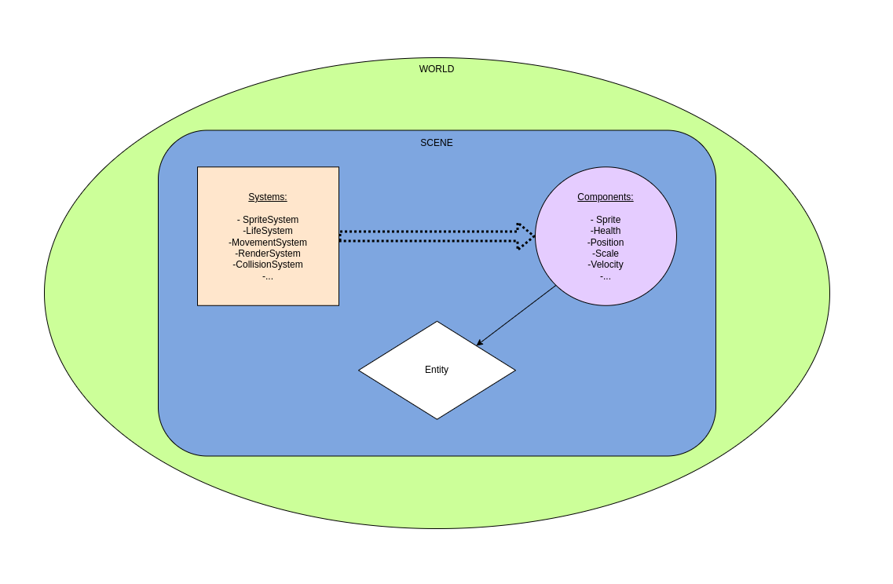

# RType
> *This is an Epitech 3rd-year project.*

# GameEngine Documentation

## Table of contents
- [What is an ecs ?](#what-is-an-ecs-)
- [Components](#components)
- [Systems](#systems)
- [How ECS works in client ?](#how-ecs-works-in-client-)

## What is an ecs ?

An Entity Component System is a design pattern that allows you to create entities and components that can be used in a game engine.  
The main idea is to create entities that are just a number, and components that are just data.  
The entities are stored in a vector for each scene, and the components are stored in a vector for each entity.  

## Components

| Component |
|-----------|
| Acceleration |
| Animation |
| Clickable |
| Collision |
| Color |
| Components |
| Controllable |
| Damage |
| FontSize |
| Health |
| Modifier |
| Music |
| Name |
| Parallax |
| Position |
| Rectangle |
| Rotation |
| Scale |
| Shooter |
| Sound |
| Sprite|
| Text |
| TextColor |
| TextInput |
| Vector2 |
| Velocity |

## Systems

| Main System | Sub System by RenderSystem |
|-------------|------------|
| Render  | Aniamation |
| Clickable  | Name |
| Collision | Rectangle |
| Destruction | Sprite |
| EventManager | Text |
| KeyboarInput | TextInput |
| Life  | 
| Modifier  |
| Music  |
| Parallax  |
| Sound  |

## How ECS works in client ?

Here's a diagram showing how ECS works on the customer side.linux.

<h1 align="center">
  
   
</h1>

Here, in the client, we can find the scene. In the scene we have: entities, components and systems.
In an entity we find components, which are attributes linked to the entity itself. For example, a human being is an entity and is made up of different components: head, arm, leg, ... .
Then we have systems, which change the values of the components.
