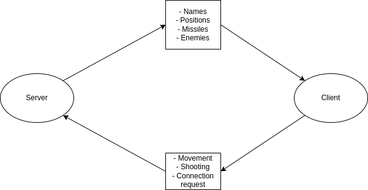

# RType
> *This is an Epitech 3rd-year project.*

# Server Documentation

## Table of contents
- [What is a server ?](#what-is-a-server-)
- [How server Works ?](#how-server-works-)
- [RFC](#RFC)

## What is a server ?

The server is an hidden interface. It manages how the players interact with the game and communicates with the clients (the players) during the game.

## How server Works ?

<h1 align="center">
  
   
</h1>

The server communicates as described in the diagram above how the server communicates with the client and receives information.

The server uses an RFC (Request For Comments) to communicate with the client. The RFC is a protocol that defines the structure of the messages exchanged between the client and the server, as well as the various message types. Additionally, it provides insights into the different server and client states, along with the distinct actions that can be executed by each party.
To learn more about the RFC, go to the [RFC](RFC.md) section.
